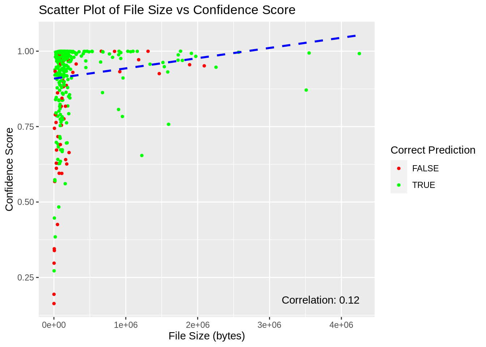

# Learning a New Skill

In this part I got 32 hours to do work on something I wanted to do or learn, I wanted to so something with machine learning as this is something very relevant. Ofcourse is 32 hours a bit short to learn about machine learning and create my own model so I decided to use an existing model, I settled with Sturgeon. 
 
## Planning

I started by creating a planning.

Day 1

- Read the paper about sturgeon, ["Ultra-fast deep-learned CNS tumour classification during surgery"](https://www.nature.com/articles/s41586-023-06615-2#Sec2)
- Trying to find data that can be used
   - Sequences of tumours in the CNS 
   - The data should be labeled so the results can be compared
   - Data ideally needs to be nanopore data
   
- Installing required programs(depends on the data I found)
  - Sturgeon - https://github.com/marcpaga/sturgeon
  - Crossmap - https://github.com/liguowang/CrossMap
  - Modkit - https://github.com/nanoporetech/modkit
  - Guppy - https://github.com/nanoporetech/pyguppyclient

Day 2

- Using the needed tools to prepare the data for running sturgeon.
- Try to run sturgeon on a couple of files to see how long it would take to run on all 415 files.

Day 3/4

- Run sturgeon on more, perhaps all files.
- Gather the reference diagnosis for every file.
- Visualize the data.

## Planning after finding Dataset

I will be using the tool [Sturgeon](https://github.com/marcpaga/sturgeon) to clasify tumors found in the central nervous system. I will use the information in this paper ["Ultra-fast deep-learned CNS tumour classification during surgery"](https://www.nature.com/articles/s41586-023-06615-2#Sec2) and using this [GSE209865](https://www.ncbi.nlm.nih.gov/geo/query/acc.cgi?acc=GSE209865) dataset from GEO. The data needs to be lifted using crossmap from the hg19 genome to the chm13v2.0 genome.

## Results

Everything I did is documented in this [Rmarkdown](sturgeon/analysis_sturgeon.html). But I will share some results here as well.
I ended up running the analysis on all the 415 files twice, one time with the lifted data and one without lifting the data.

Let's import the data.

```{r, message=F, warning=F}
library(dplyr)
library(ggplot2)
library(DT)
library(data.table)
library(fs)
```


```{r}
output_table_matched <- read.delim("sturgeon/sturgeon_dataframes/output_table_matched.tsv")
output_table_matched_raw_data <- read.delim("sturgeon/sturgeon_dataframes/output_table_matched_raw_data.tsv")

```

Let's check how many of the predictions were correct and how many were wrong.
```{r, echo=FALSE, warning=FALSE}
# create plot
ggplot(output_table_matched, aes(x = factor(correct_prediction), fill = correct_prediction)) +
  geom_bar() +
  geom_text(stat = 'count', aes(label = ..count..), vjust = -0.5) +
  scale_fill_manual(values = c("TRUE" = "skyblue", "FALSE" = "brown1")) +
  labs(title = "Correct Predictions",
       x = "Correct Prediction",
       y = "Count")
```

Here we see that 365 of the 415 predictions were correct that's around 88% 

But sturgeon gives a confidence score the following is written in the README about the confidence score.
score < 0.8: inconclusive result.
0.8 <= score < 0.95: confident result that the class is correct.
score >= 0.95: high confident result that the class is correct.

Lets look at only the predictions that got a score above 0.8.

```{r, echo=FALSE, warning=FALSE}
output_table_matched %>% filter(confidence_score >= 0.8) %>%
  ggplot(aes(x = factor(correct_prediction), fill = correct_prediction)) +
  geom_bar() +
  geom_text(stat = 'count', aes(label = ..count..), vjust = -0.5) +
  scale_fill_manual(values = c("TRUE" = "skyblue", "FALSE" = "brown1")) +
  labs(title = "Correct Predictions for predicitons with confidence score > 0.8",
       x = "Correct Prediction",
       y = "Count")

```

The amount of wrong predictions almost halved, of the predictions with a confidence score above 0.8 about 92.5% were correct.

And then also look at the predictions that have a high confident result > 0.95
```{r, echo=FALSE, warning=FALSE}
output_table_matched %>% filter(confidence_score >= 0.95) %>%
  ggplot(aes(x = factor(correct_prediction), fill = correct_prediction)) +
  geom_bar() +
  geom_text(stat = 'count', aes(label = ..count..), vjust = -0.5) +
  scale_fill_manual(values = c("TRUE" = "skyblue", "FALSE" = "brown1")) +
  labs(title = "Correct Predictions for predicitons with confidence score > 0.95",
       x = "Correct Prediction",
       y = "Count")
```

The predictions with a confidence score above 0.95 are even more accurate with about 94,7% accuracy.


Lets take a look at the wrong predictions, lets see which reference diagnosis were guessed wrong the most

```{r, echo=FALSE, warning=FALSE}
# Filter incorrect predictions
incorrect_predictions <- output_table_matched %>% filter(correct_prediction == FALSE)

# Count the number of occurrences for each mistake
mistake_counts <- table(incorrect_predictions$reference_diagnosis.x)

# Count the total occurrences for each reference_diagnosis
total_counts <- table(output_table_matched$reference_diagnosis.x)

# Normalize the mistake counts by dividing by total occurrences
normalized_counts <- mistake_counts / total_counts[as.character(names(mistake_counts))]

# Create a data frame from the normalized_counts
sorted_data <- data.frame(
  prediction = names(normalized_counts),
  count = as.numeric(normalized_counts),
  total_wrong_guesses = as.numeric(mistake_counts)
)

# Sort the data frame by count in descending order
sorted_data <- sorted_data[order(-sorted_data$count), ]

# Set a threshold for the most frequent mistakes
threshold <- 0.1
top_mistakes <- sorted_data[sorted_data$count >= threshold, ]

# Reorder levels of the prediction factor based on count
top_mistakes$prediction <- factor(top_mistakes$prediction, levels = top_mistakes$prediction)

# Create plot
ggplot(top_mistakes, aes(x = prediction, y = count, fill = total_wrong_guesses, label = total_wrong_guesses)) +
  geom_bar(stat = "identity") +
  geom_text(vjust = -0.5, size = 3) +  # Add text labels for counts
  scale_fill_gradient(low = "lightblue", high = "darkblue") +  # Color scale for total wrong guesses
  theme(axis.text.x = element_text(angle = 60, hjust = 1)) +
  labs(
    title = "Most Frequent Incorrect Guesses (Normalized)",
    x = "Prediction",
    y = "Normalized Count",
    fill = "Total Wrong Guesses"
  ) +
  ylim(0, 1.2) +
  guides(fill = FALSE)

```

The data in the graph is normalized so bars that have a normalized count of 1 were never guessed correctly, but most of these only occur once.
Glioblastoma, IDH-wildtype is guessed wrong most often but appears a hundred times in the dataset so its still guessed right more than 80% of the time.
It's also very much possible that some of the predictions that are marked as wrong might be correct but that something went wrong when translating the prediction to the reference_diagnosis form.

I noticed that the .bed files differed quite a lot in size, so i wondered whether confidence score or maybe the amount of correct prediction increased when the size of the file was bigger.



There is a small correlation between file size and confidence score, The predictions with very low confidence score are always small files.

Lets take a look at the predictions from the raw_data run.
```{r, echo=FALSE, warning=FALSE}
# create plot
ggplot(output_table_matched_raw_data, aes(x = factor(correct_prediction), fill = correct_prediction)) +
  geom_bar() +
  geom_text(stat = 'count', aes(label = ..count..), vjust = -0.5) +
  scale_fill_manual(values = c("TRUE" = "skyblue", "FALSE" = "brown1")) +
  labs(title = "Correct Predictions",
       x = "Correct Prediction",
       y = "Count")
```

The amount of wrong predictions are exactly the same as the amount of wrong predictions when using the lifted files.

But maybe the predictions are made with less confidence


```{r, echo=FALSE, warning=FALSE}
output_table_matched$confidence_score %>% mean() - output_table_matched_raw_data$confidence_score %>% mean()

```
The mean confidence scores of the two runs are very close to each other and the raw_data mean is even a little higher.

Lets look at the distribution of the confidence scores

```{r, echo=FALSE, warning=FALSE}
# Combine data for plotting using dplyr::bind_rows
combined_data <- bind_rows(
  mutate(output_table_matched, Dataset = "Matched"),
  mutate(output_table_matched_raw_data, Dataset = "Raw Data")
)

ggplot(combined_data, aes(x = Dataset, y = confidence_score, fill = as.factor(correct_prediction))) +
  geom_violin(position = "dodge", trim = FALSE) +  # Adjust position for proper alignment
  labs(title = "Violin Plot of Confidence Scores",
       x = "Dataset",
       y = "Confidence Score",
       fill = "Correct Prediction") +
  coord_cartesian(ylim = c(0, 1))  # Set y-axis limits to 0 and 1

```

The two violin plots look almost identical, running sturgeon without lifting the genome doesn't change much about the confidence score.


Let's see if there were instances where there was something different guessed between the two runs.

```{r, echo=FALSE, warning=FALSE}
# Merge the dataframes 
merged_data <- merge(
  output_table_matched,
  output_table_matched_raw_data,
  by = "GEO_accession",
  suffixes = c("", "_raw")
)

# Filter rows where correct_prediction is different
differing_values <- merged_data[merged_data$correct_prediction != merged_data$correct_prediction_raw, ]

differing_values %>% 
  select(GEO_accession, reference_diagnosis.x, matched_reference_diagnosis, matched_reference_diagnosis_raw)


```
As we can see there are two instances where a different guess was made, once the run with the raw_files guessed the wrong Glioblastoma type and once the run with lifted files geussed the Ependymoma wrong. 

lifting the genome to CHM13v2 doesn't seem that important at least not when working with data aligned to the hg19 genome.

## Evaluation

I am very satisfied with the result of this analysis, it was a lot of fun to come up with my own ideas for what to do. And it was very satisfying to find solution on the problems I was facing. I don't think I necessarily learned a specific new skill, but I certainly learned new things from this experience, whilst navigating my way around this analysis and the different tools, and problem solving the problem that I encountered. 
