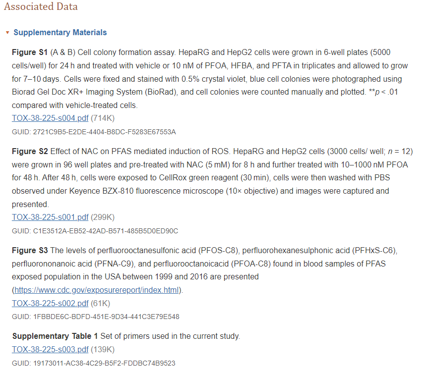

# Peer review

In this part we will look into reproducibilty of scientific publications, we will be doing this by comparing a paper to the criteria that is available on [Researchgate](https://www.researchgate.net/publication/340244621_Reproducibility_and_reporting_practices_in_COVID-19_preprint_manuscripts), and by trying to recreate a part of the analysis from an different paper.

<h2>

Per‐ and polyfluoroalkyl substances activate UPR pathway, induce steatosis and fibrosis in liver cells

</h2>

<https://doi.org/10.1002/tox.23680>

<h5>

Qi, Q., Niture, S., Gadi, S., Arthur, E., Moore, J., Levine, K. E., & Kumar, D. (2023)

</h5>

The article researches how the retention of fat, fibrogenic signals and cell survival are influenced by low concentrations of three different PFAS in liver cell models. This is done using a handfull of techniques like cell counting and staining, RT qPCR, RNA-seq and others. Important findings are that PFAS in low concentrations can cause ER stress, steatosis and fibrogenic signaling, therefore associating PFAS to the development of non alcoholic fatty liver disease.

We will score this paper on the following criteria: Study Purpose, Data Availability Statement, Data Location, Study Location, Author Review, Ethics Statement, Funding Statement and on Code Availability. This is done by filling in the table provided on Researchgate.

The table seen beneath is the table with criteria filled in for the study we chosen above.

+-----------------------------+--------------------------------------------------------------------------------------------------------------------------------------------------------------------------------------------------------------------------------------------------------------------------+---------------------+---------------------------------------------------------------------------------------------------+
| Transparency Criteria       | Definition                                                                                                                                                                                                                                                               | Response Type       | Score                                                                                             |
+=============================+==========================================================================================================================================================================================================================================================================+=====================+===================================================================================================+
| Study Purpose               | A concise statement in the introduction of the article, often in the last paragraph, that establishes the reason the research was conducted. Also called the study objective.                                                                                            | Binary              | no                                                                                                |
+-----------------------------+--------------------------------------------------------------------------------------------------------------------------------------------------------------------------------------------------------------------------------------------------------------------------+---------------------+---------------------------------------------------------------------------------------------------+
| Data Availability Statement | A statement, in an individual section offset from the main body of text, that explains how or if one can access a study's data. The title of the section may vary, but it must explicitly mention data; it is therefore distinct from a supplementary materials section. | Binary              | no                                                                                                |
+-----------------------------+--------------------------------------------------------------------------------------------------------------------------------------------------------------------------------------------------------------------------------------------------------------------------+---------------------+---------------------------------------------------------------------------------------------------+
| Data Location               | Where the article's data can be accessed, either raw or processed.                                                                                                                                                                                                       | Found Value         | ArrayExpress E‐MTAB‐11670, cell photographs are linked at the top under "Supplementary Materials" |
+-----------------------------+--------------------------------------------------------------------------------------------------------------------------------------------------------------------------------------------------------------------------------------------------------------------------+---------------------+---------------------------------------------------------------------------------------------------+
| Study Location              | Author has stated in the methods section where the study took place or the data's country/region of origin.                                                                                                                                                              | Binary; Found Value | no                                                                                                |
+-----------------------------+--------------------------------------------------------------------------------------------------------------------------------------------------------------------------------------------------------------------------------------------------------------------------+---------------------+---------------------------------------------------------------------------------------------------+
| Author Review               | The professionalism of the contact information that the author has provided in the manuscript.                                                                                                                                                                           | Found Value         | Tier 3                                                                                            |
+-----------------------------+--------------------------------------------------------------------------------------------------------------------------------------------------------------------------------------------------------------------------------------------------------------------------+---------------------+---------------------------------------------------------------------------------------------------+
| Ethics Statement            | A statement within the manuscript indicating any ethical concerns, including the presence of sensitive data.                                                                                                                                                             | Binary              | no                                                                                                |
+-----------------------------+--------------------------------------------------------------------------------------------------------------------------------------------------------------------------------------------------------------------------------------------------------------------------+---------------------+---------------------------------------------------------------------------------------------------+
| Funding Statement           | A statement within the manuscript indicating whether or not the authors received funding for their research.                                                                                                                                                             | Binary              | yes                                                                                               |
+-----------------------------+--------------------------------------------------------------------------------------------------------------------------------------------------------------------------------------------------------------------------------------------------------------------------+---------------------+---------------------------------------------------------------------------------------------------+
| Code Availability           | Authors have shared access to the most updated code that they used in their study, including code used for analysis.                                                                                                                                                     | Binary              | no                                                                                                |
+-----------------------------+--------------------------------------------------------------------------------------------------------------------------------------------------------------------------------------------------------------------------------------------------------------------------+---------------------+---------------------------------------------------------------------------------------------------+

Data Availablilty statement is score as a no, but at the beginning of the paper there is a small paragraph called Supplementary Materials where the cell photographs are linked.  But there is no part about the RNA-seq data or the qPCR data. The RNA-seq data can be found hidden at the end of the methods.

There is a clear statement about funding: Funding information National Institutes of Health, Grant/Award Numbers: R01MD012767, U54MD012392, U01CA194730.

There is no ethics statement and nothing is said about code used.

<h2>

My host's enemy is my enemy: plasmids carrying CRISPR-Cas as a defence against phages

</h2>

<https://doi.org/10.1101/2023.11.01.565096>

<h5>

Berit Siedentop, Dario Rüegg, Sebastian Bonhoeffer, Hélène Chabas. (2023)

</h5>

The code and data used in this paper can be found [here](https://osf.io/hcvsr/) we will try to 
