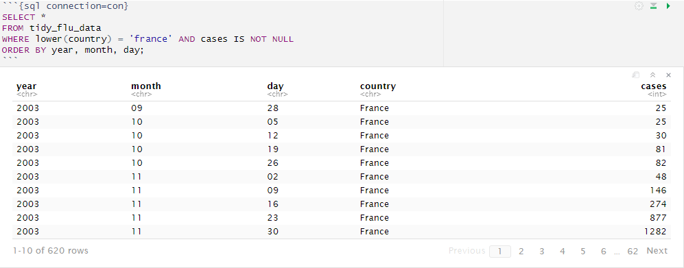

# SQL
N.B. some of the steps are done using an connection to a local postgres database, because these wouldn't work in an R markdown they are replaced by screenshots.

## Getting the data
First we need to get the data for the exercise, we use wget to download them from github.
```{bash, eval=FALSE}

# Go to data_raw
cd sql/raw_data/ 

# Download the flu dataset
wget -O flu_data.csv https://raw.githubusercontent.com/DataScienceILC/tlsc-dsfb26v-20_workflows/main/data/flu_data.csv

# Download the dengue dataset
wget -O dengue_data.csv https://raw.githubusercontent.com/DataScienceILC/tlsc-dsfb26v-20_workflows/main/data/dengue_data.csv
```


## Tidy the data
Its important to make the data tidy so every table matches structure wise, in these steps we also make some changes to make merging later easier.

```{r message=FALSE, warning=FALSE}
#load needed libraries
library(tidyr)
library(dplyr)
library(RPostgreSQL)
library(dslabs)
```
```{r}

# Load the different data
flu_data <- read.csv("sql/raw_data/flu_data.csv", skip = 11) # skip = 11 to skip the first 11 lines which contain metadata
dengue_data <- read.csv("sql/raw_data/dengue_data.csv", skip = 11)
gapminder_data <- as_tibble(gapminder)


## flu_data
# Make flu_data tidy
tidy_flu_data <- flu_data %>%
  pivot_longer(cols = -Date, names_to = "country", values_to = "cases")

# Split Date into year, month, day
tidy_flu_data <- tidy_flu_data %>%
  separate(Date, into = c("year", "month", "day"), sep = "-")

# Convert year into factor
tidy_flu_data$year <- as.factor(tidy_flu_data$year)

# flu_data uses dots instead of spaces in country names (New.Zealand)
# So to make joining the tables easier we need to replace the dots with spaces
tidy_flu_data$country <- gsub("\\.", " ", tidy_flu_data$country)

# turn country into factor
tidy_flu_data$country <- as.factor(tidy_flu_data$country)

# dengue_data
# Make dengue_data tidy
tidy_dengue_data <- dengue_data %>%
  pivot_longer(cols = -Date, names_to = "country", values_to = "cases")

# Split Date into year, month, day
tidy_dengue_data <- tidy_dengue_data %>%
  separate(Date, into = c("year", "month", "day"), sep = "-")

# Convert year into factor
tidy_dengue_data$year <- as.factor(tidy_dengue_data$year)

# turn country into factor
tidy_dengue_data$country <- as.factor(tidy_dengue_data$country)


# Save tidy_dengue_data
write.csv(tidy_dengue_data, "sql/data/tidy_dengue_data.csv")
saveRDS(tidy_dengue_data, "sql/data/tidy_dengue_data.rds")

# Save tidy_flu_data
write.csv(tidy_flu_data, "sql/data/tidy_flu_data.csv")
saveRDS(tidy_flu_data, "sql/data/tidy_flu_data.rds")

# Save clean gapminder_data
write.csv(gapminder_data, "sql/data/tidy_gapminder_data.csv")
saveRDS(gapminder_data, "sql/data/tidy_gapminder_data.rds")

```
The chunck beneath is to create an connection object, that can be used to connect to a Postgres database.
```{r, eval=FALSE}
# Load packages
library(RPostgreSQL)
library(DBI)

# Create connection object to connect to local PostgreSQL database
con <- dbConnect(RPostgres::Postgres(), 
                 dbname = "workflowsdb", 
                 host="localhost", 
                 port="5432", 
                 user="postgres", 
                 password="PASSWORD")
```

This chunck would normaly create tables in the postgres database.

```{r, eval=FALSE}
# Load tidy_flu_data into Postgres database
dbWriteTable(con, "tidy_flu_data", as.data.frame(tidy_flu_data), overwrite = TRUE)

# Load tidy_dengue_data into Postgres database
dbWriteTable(con, "tidy_dengue_data", as.data.frame(tidy_dengue_data), overwrite = TRUE)

# Load gapminder_data into Postgres database
dbWriteTable(con, "gapminder_data", as.data.frame(gapminder_data), overwrite = TRUE)
```

## Using SQL and R to inspect data
We use both SQL and R to inspect the data in the same way

### Gapminder
Here we order the gapminder data by life expactancy.

Using R with the same goal.
```{r}
gapminder_data %>%
  arrange(desc(life_expectancy))
```
### Flu
Here we select only the cases in France from the flu data.

Again using R for the same goal.
```{r}
tidy_flu_data %>%
  filter(tolower(country) == 'france' & !is.na(cases)) %>%
  arrange(year, month, day)
```
### Dengue
Here we sort dengue by cases from high to low.

And again R for the same goal.
```{r}
tidy_dengue_data %>%
  filter(!is.na(cases)) %>%
  arrange(desc(cases))
```
Here you can see that in every country, the highest case is 1 because the data is relative per country. The day where there were the most Google searches about dengue is labeled as one, and the day with the fewest is labeled as 0. Every other day is on the scale between those.

## Summarzing flu and dengue
Both the flu and dengue data have datapoints every day, while gapminder has a datapoint for every year. Before we can join flu and dengue with gapminder we first have to summarize the data so flu and dengue to have a datapoint for every year.

For flu we can just take the total of every case, hence we use sum in the summarize function.
```{r, eval=FALSE}
summarized_flu_data <- tidy_flu_data %>%
  mutate(Date = as.Date(paste(year, month, day, sep = "-"))) %>%
  group_by(country, year) %>%
  summarize(total_cases_flu = sum(cases, na.rm = TRUE)) %>%
  ungroup()
```
For dengue, we need to calculate the average because the data is on a scale where 1 represents the highest search activity in a country, and 0 represents the lowest. Therefore, we use the mean function in the summarize function.
```{r, eval=FALSE}
summarized_dengue_data <- tidy_dengue_data %>%
  mutate(Date = as.Date(paste(year, month, day, sep = "-"))) %>%
  group_by(country, year) %>%
  summarize(avg_cases_dengue = mean(cases, na.rm = TRUE)) %>%
  ungroup()
```

Now we load the new summarized files into the database.
```{r, eval=FALSE}
# Load summarized_flu_data
dbWriteTable(con, "summarized_flu_data", as.data.frame(summarized_flu_data), overwrite = TRUE)

# Load summarized_dengue_data
dbWriteTable(con, "summarized_dengue_data", as.data.frame(summarized_dengue_data), overwrite = TRUE)
```
## Merging the tables
Normally this could be used to merge the tables and load the table into R.
```{r, eval=FALSE}
# SQL to merge tables
sql_query <- "
SELECT
    COALESCE(d.country, f.country) AS merged_country,
    COALESCE(d.year, f.year::text) AS merged_year,
    d.avg_cases_dengue,
    f.total_cases_flu,
    g.*
FROM
    summarized_dengue_data AS d
FULL JOIN
    summarized_flu_data AS f ON d.year = f.year::text AND d.country = f.country
JOIN
    gapminder_data AS g ON COALESCE(d.year, f.year::text) = g.year::text AND COALESCE(d.country, f.country) = g.country
ORDER BY
    COALESCE(d.avg_cases_dengue, 0) DESC, COALESCE(f.total_cases_flu, 0) DESC;
"
# Export table to R
merged_table <- dbGetQuery(con, sql_query)
summary(merged_table)
```
Because we can't use SQL we just load the merged table in using R, and create a summary of the data.
```{r}
merged_table <- readRDS("sql/data/merged_table.rds")
summary(merged_table)
```

## Creating some plots
We now use the merged table to create some plots to visualize the data.

Create boxplot of life expectancy per continent.
```{r}
library(ggplot2)

# Boxplot of Life Expectancy by Continent
ggplot(merged_table, aes(x = continent, y = life_expectancy, fill = continent)) +
  geom_boxplot() +
  labs(title = "Boxplot of Life Expectancy by Continent",
       x = "Continent",
       y = "Life Expectancy") +
  theme_minimal() +
  scale_fill_discrete(name = "Continent")
```
Linegraph for dengue cases in Brazil, Argentina and Bolivia.
```{r}
# chosen 3 random countries
selected_countries <- c("Brazil", "Argentina", "Bolivia")
filtered_data_dengue <- merged_table[merged_table$country %in% selected_countries, ]

# Line plot of Dengue cases for Brazil, Argentina and Bolivia
ggplot(filtered_data_dengue, aes(x = year, y = avg_cases_dengue, color = country)) +
  geom_line() +
  labs(title = "Dengue Cases Over the Years (Selected Countries)",
       x = "Year",
       y = "Average Dengue Cases",
       color = "Country") +
  theme_minimal()
```
Flu cases per capita per country.
```{r}
# Filter data to exclude NA values
filtered_data <- merged_table %>% filter(!is.na(total_cases_flu) & !is.na(population))

# Divide the cases by the population
filtered_data$flu_ratio <- filtered_data$total_cases_flu / filtered_data$population

# Create a box plot
ggplot(filtered_data, aes(x = merged_country, y = flu_ratio)) +
  geom_boxplot() +
  labs(title = "Distribution of Flu Cases per Population per Country",
       x = "Country",
       y = "Flu Cases per Population") +
  theme_minimal() +
  theme(axis.text.x = element_text(angle = 45, hjust = 1))  # Make readable


```
