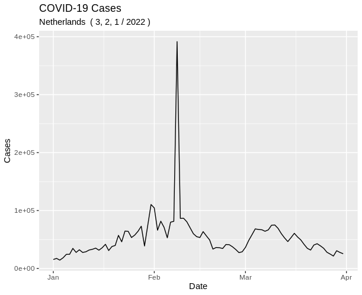

# R package
I created an R package {CovidReportECDC}, the package can be installed using devtools. The package contains three functions and can be used to make plots about covid. The R package can be found on my [github](https://github.com/TWANANAS/CovidReportECDC). 

I will show an example of how it could be used bellow.

```{r, eval=FALSE}
devtools::install_github("twananas/CovidReportECDC")
library(CovidReportECDC)
```


```{r, eval=FALSE}
plot_covid(country = "Netherlands", 2022, c(1,2,3) )
```

